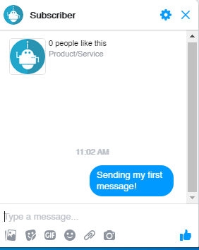
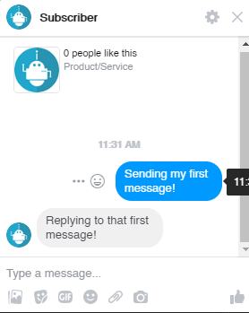

In this guide we use the [Facebook Messenger](doc:conversation-send-a-message-with-fb-messenger), if you like you can use the [SMS channel](doc:conversation-send-sms) or any [other channel](doc:conversation-channel-support)

> 🚧 Warning
>
> Please note that there's a standard messaging window of 24h on Messenger. To be able to send messages outside this response window check out [**Channel Specific Properties**](doc:conversation-channel-support-channel-properties) for more info. 

## Create a simple webhook using Node.js

First create a new node app and then run the following on the command line to create the needed dependency.

**Note**: You would need to use the right region api endpoint where your Conversation App resides. In this tutorial, we assume our app resides in EU region.

`npm install express body-parser --save` This will install the [Express](https://www.npmjs.com/package/express) http server framework module.

Now add the following code to your index.js

```javascript
const express = require("express"),
  bodyParser = require("body-parser"),
  app = express().use(bodyParser.json());
port = 3000;

app.post("/webhook", (req, res) => {
  let body = req.body;
  let {
    message: {
      contact_message: {
        text_message: { text },
      },
    },
  } = body;
  console.log(text);
  res.sendStatus(200);
});

app.listen(port, () => console.log(`Listening to ${port}..`));
```

This code will allow you to listen for incoming messages and will parse out the text message content.
If you want to see the payload not parsed, add `console.log(JSON.stringify(body, null, 2));`

Before you can handle incoming traffic to your local server, you need to open up a tunnel to your local server, for that you can use [ngrok](https://ngrok.com/) tunnel. Open a terminal/command prompt and type: `ngrok http 3000`

The Node app and Ngrok should be running at the same time at port 3000.


## Configure a webhook

Go to your Conversation App dashboard and select
`Conversations` on the left side menu.

Then select `Apps` from the drop-down menu and select the App you want to add a webhook too.


For this example, I will be using **Test** as my app.

Once you have selected your App, scroll down to **Webhook** section and select the **Add Webhook** button. There will be a pop-up with empty required fields.


Fill in the following:

Select **Target Type** to HTTP

Select **Target URL** as your ngrok url

Select `MESSAGE_INBOUND`, `MESSAGE_DELIVERY`, `EVENT_DELIVERY`, `MESSAGE_INBOUND`, `EVENT_INBOUND`, `CONVERSATION_START`, `CONVERSATION_STOP`, `UNSUPPORTED` as **Trigger**


Now your webhook is setup with the Conversation App.

---

## Start a Conversation

Now that your webhook is setup with the Conversation App and ngrok along with your node app are running and listening to port 3000- it's time to test the webhook.
For this demo, we will be using Facebook Messenger channel as our example. Open up Facebook Messenger and send a message to your test account. If you do not have an account, please look into [Send a message with Facebook Messenger](doc:conversation-send-a-message-with-fb-messenger) before proceeding.



if you did everything correctly, you will receive a `status 200 OK` on ngrok and the text message on your console log.


---

## Sending a reply via Webhook

Copy the following code on top of your current webhook and then re-run your node application.

```javascript
const express = require("express");
const request = require("request-promise");
const bodyParser = require("body-parser");
app = express().use(bodyParser.json());
port = 3000;

const APP_ID = "APP_ID_HERE",
  PROJECT_ID = "PROJECT_ID_HERE",
  client_id = "CLIENT_ID_HERE",
  client_secret = "CLIENT_SECRET_HERE";

/* Please note that client id and secret are essentially equivalent to a username and password. This code is for example purposes and is not meant for production.*/

const getAuthToken = () => {
  return request({
    url: "https://eu.auth.sinch.com/oauth2/token",
    method: "POST",
    auth: { user: client_id, pass: client_secret },
    form: { grant_type: "client_credentials" },
    json: true,
  });
};

const sendMessage = async (contact_id, text) => {
  const res = await getAuthToken();
  const token_type = res.token_type;
  const token = res.access_token;
  return request({
    url: `https://eu.conversation.api.sinch.com/v1beta/projects/${PROJECT_ID}/messages:send`,
    method: "POST",
    headers: {
      "Content-Type": "application/json text/plain",
      Authorization: `${token_type} ${token}`,
    },
    body: {
      app_id: APP_ID,
      recipient: {
        contact_id,
      },
      message: {
        text_message: {
          text,
        },
      },
      channel_priority_order: ["MESSENGER"],
    },
    json: true,
  });
};

app.post("/webhook", (req, res) => {
  let body = req.body;
  let {
    message: {
      contact_message: {
        text_message: { text },
      },
      contact_id,
    },
  } = body;
  if (text) {
    sendMessage(contact_id, "Hello World").then((res) => console.log(res));
  }
  console.log(`MESSAGE RECEIVED: ${text}`);
  res.sendStatus(200);
});

app.listen(port, () => console.log(`Listening to ${port}..`));
```

if everything is done correctly, you will receive a message back from your webhook on Messenger. On your terminal, you will receive data regarding the `message id` and `accepted time`



Now your webhook is ready to receive and send a message back!

If you want to send something other than a text message on Messenger, refer to
[Sending a Rich message with Facebook Messenger](doc:conversation-send-rich-messages-with-fb-messenger)
